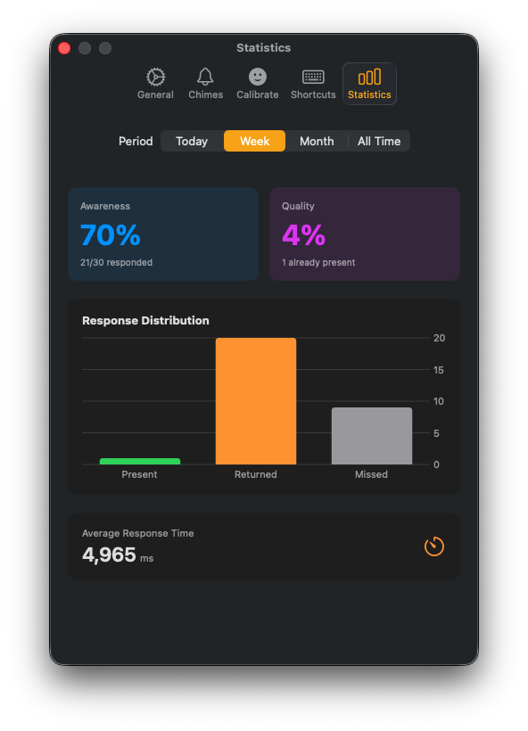
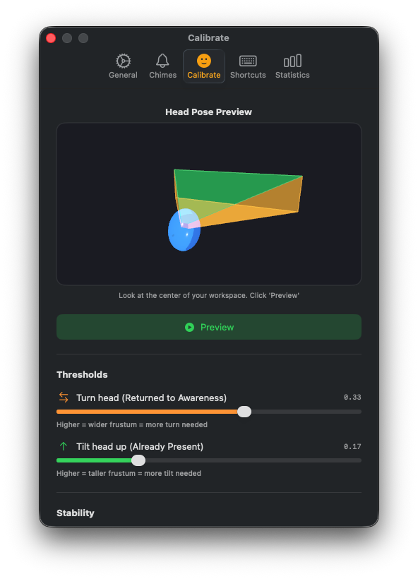

# Awareness Anchor

A mindfulness bell app for macOS that plays random chimes throughout your day, prompting moments of present-moment awareness.

Originally a web application, now available as a native macOS menu bar app.

## Screenshots

<p align="center">
  
  
</p>

### Head Pose Calibration Demo


*The calibration view shows real-time head tracking with visual feedback. Screen edge glows indicate gaze direction, and responses are triggered when the gaze exits the threshold frustum.*

## Features

- **Random Interval Chimes**: Plays Tibetan singing bowl sounds at random intervals based on your configured average interval (3 seconds to 5 minutes)
- **Response Tracking**: After each chime, respond to indicate your state of awareness:
  - **Present**: You were already mindful when the bell rang
  - **Returned**: The bell brought you back to awareness
  - **Missed**: No response within the response window
- **Statistics Dashboard**: Track your daily awareness metrics
  - Present/Returned/Missed counts
  - Awareness ratio (responded / total)
  - Quality ratio (present / responded)
- **Head Pose Detection**: Optionally respond to chimes using head gestures detected via your Mac's front camera
- **Global Keyboard Shortcuts**: Respond without switching apps
- **Menu Bar App**: Runs unobtrusively in your menu bar

## Requirements

- macOS 13.0 (Ventura) or later
- Front-facing camera (for head pose detection feature)

## Building and Running

### From Xcode

1. Open `AwarenessAnchor/AwarenessAnchor.xcodeproj` in Xcode
2. Select your development team in Signing & Capabilities
3. Build and run (Cmd+R)

### First Launch

On first launch, macOS may prompt for camera access if head pose detection is enabled. Grant permission to use this feature.

## Usage

### Menu Bar Icon

Click the bell icon in the menu bar to open the control popover.

### Play/Pause

Click the Play button to start receiving mindfulness chimes. The app will play random Tibetan singing bowl sounds at intervals averaging your configured time.

### Responding to Chimes

When a chime plays, a **Response Window** opens (default: 10 seconds). During this window:

1. **Using the UI**: Click "Present" or "Returned" buttons in the popover
2. **Using Keyboard Shortcuts**:
   - `Cmd+Shift+1`: Already Present
   - `Cmd+Shift+2`: Returned to Awareness
3. **Using Head Gestures** (if enabled):
   - **Look Up**: Already Present
   - **Turn Head Left/Right**: Returned to Awareness

If you don't respond within the window, the chime is recorded as "Missed".

### Adjusting Interval

Use the slider in the popover to adjust the average interval between chimes (3 seconds to 5 minutes). The actual interval varies randomly around this average.

### Settings

Click "Settings..." to access:
- Response window duration
- Head pose detection toggle
- Sound selection (future)

## Head Pose Detection

The head pose detection feature uses Apple's Vision framework to detect head movements via your Mac's front camera.

### How It Works

1. Camera activates only during the response window (not continuously)
2. On activation, your current head position becomes the baseline
3. Significant movements from baseline trigger responses:
   - **Pitch up** (look up ~15 degrees): "Already Present"
   - **Yaw** (turn head left/right ~20 degrees): "Returned to Awareness"

### Privacy Note

- Camera only runs during the brief response window
- No images are stored or transmitted
- All processing happens locally on your device

### Enabling Head Pose Detection

1. Open Settings
2. Toggle "Enable Head Pose Detection"
3. Grant camera permission when prompted

## Keyboard Shortcuts

| Shortcut | Action |
|----------|--------|
| `Cmd+Shift+1` | Record "Already Present" response |
| `Cmd+Shift+2` | Record "Returned to Awareness" response |

These shortcuts work globally, even when the app is not focused.

## Project Structure

```
AwarenessAnchor/
├── AwarenessAnchor.xcodeproj
└── AwarenessAnchor/
    ├── AwarenessAnchorApp.swift    # App entry point, AppDelegate
    ├── Models/
    │   ├── AppState.swift          # Central state management
    │   ├── ChimeEvent.swift        # Chime event data model
    │   └── Session.swift           # Session data model
    ├── Views/
    │   ├── MenuBarView.swift       # Main popover UI
    │   ├── SettingsView.swift      # Settings panel
    │   └── StatsView.swift         # Statistics display
    ├── Services/
    │   ├── AudioPlayer.swift       # Sound playback
    │   ├── ChimeScheduler.swift    # Random interval scheduling
    │   ├── DataStore.swift         # Persistence (SQLite)
    │   ├── HeadPoseDetector.swift  # Vision-based head tracking
    │   └── HotkeyManager.swift     # Global keyboard shortcuts
    └── Resources/
        └── (sound files)
```

## Web Version

The original web version is available in `index.html` at the project root. It uses:
- Tone.js for audio scheduling
- HTML5 Audio for sound playback
- Remote MP3 files for singing bowl sounds

## Credits

- Sound files sourced from Pixabay
- Web version: "Vibe-coded by Eric Nguyen with Gemini 2.5 Pro"
- macOS port: Built with Claude

## License

MIT License
